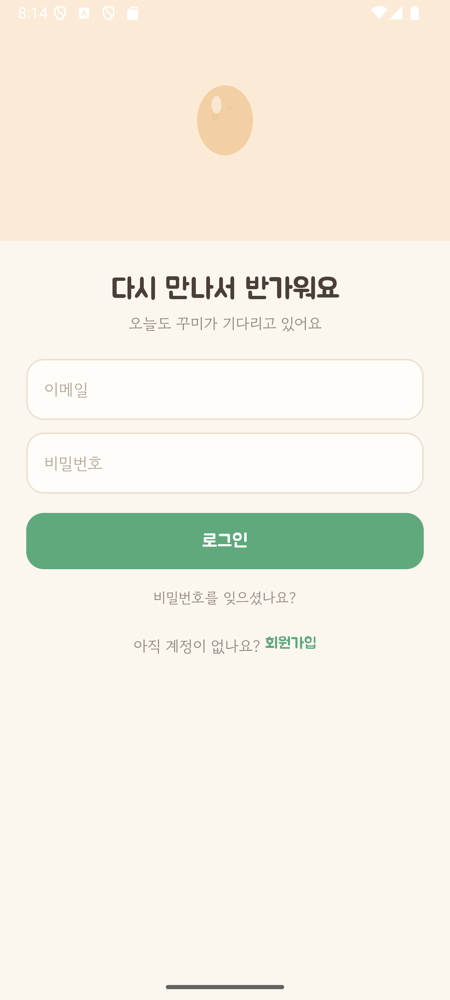
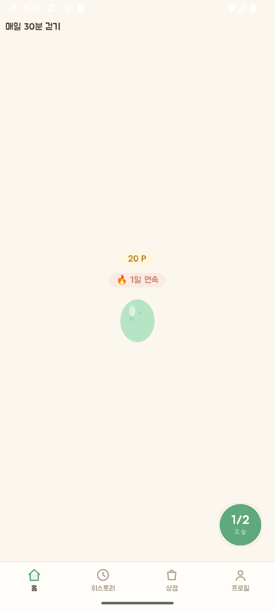
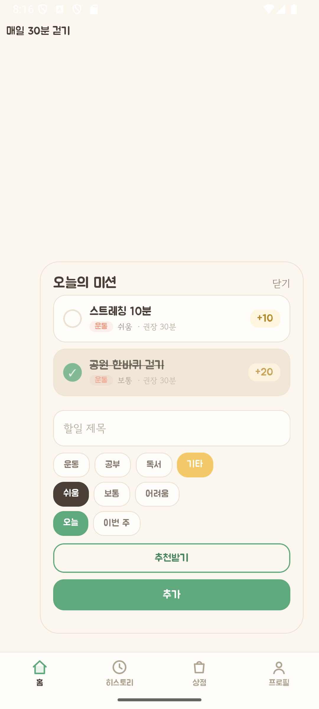
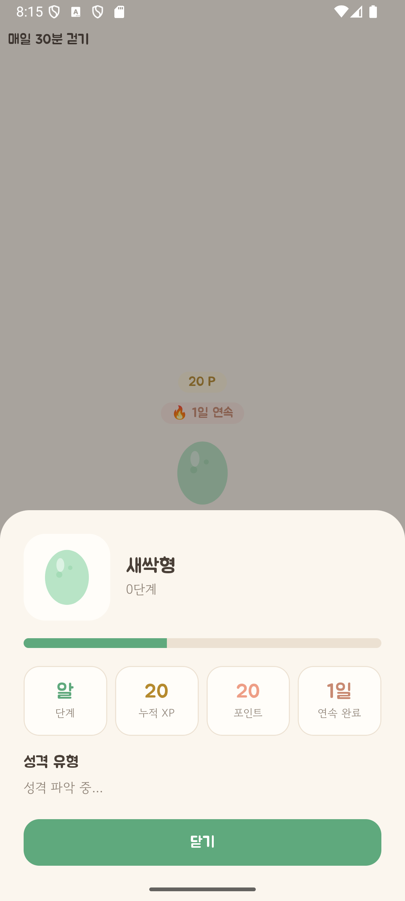
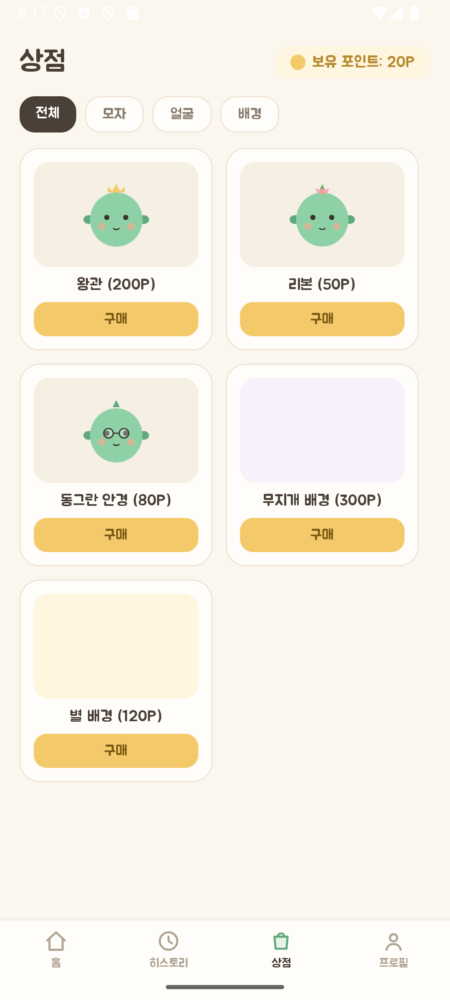
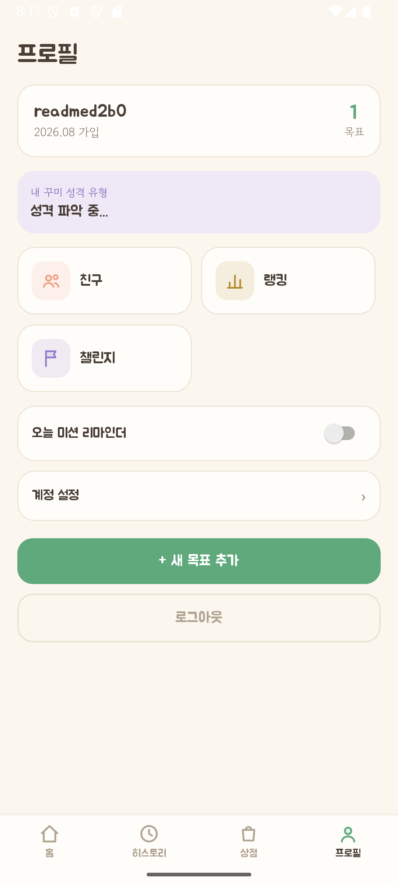

# 그로우미 (GrowMe)

할일을 끝낼 때마다 "꾸미"라는 캐릭터가 자라는 습관관리 앱. 체크박스 대신 캐릭터를 키우는 걸로 동기부여를 준다.

원래는 타이머 기반 웹 서비스로 시작했다가, "할일을 완료해야만 성장한다"는 원칙으로 React Native 앱으로 갈아엎었다. `frontend/`는 그 시절 코드고 지금은 안 쓴다 — 실제 앱은 `mobile/`.

## 스크린샷

<table>
<tr>
<td><br>로그인</td>
<td><br>홈</td>
<td><br>오늘의 미션</td>
</tr>
<tr>
<td><br>꾸미 정보</td>
<td><br>상점</td>
<td><br>프로필</td>
</tr>
</table>

## 어떻게 굴러가나

목표(Goal)를 세우면 AI가 대화로 목표를 잡아주거나, 대화 없이 직접 입력해도 된다. 목표 밑에 할일(Task)을 만들고 완료하면 XP가 쌓이고, 같은 양만큼 포인트도 쌓인다. XP는 꾸미 성장 단계를 올리고, 포인트는 상점에서 꾸미 꾸미는 데 쓴다.

- 완료/실패할 때마다 AI가 그때그때 다른 반응 문구를 보여준다 (AI가 막히면 미리 준비된 문구로 대체)
- 완료 이력에서 "성격 유형"을 계산해서 보여준다 (꾸준한 편인지, 막판에 몰아치는 편인지 등)
- 연속 완료일수(스트릭)도 추적
- 할일마다 집중 타이머를 켤 수 있고, 카테고리별 권장 시간 이상 채우면 XP 보너스
- 친구 추가, 랭킹(주간/전체), 챌린지(같이 XP 채우기)
- 신고/차단 기능

## 스택

- 모바일: React Native + Expo (SDK 54)
- 백엔드: Node.js + Express + Prisma + PostgreSQL
- AI: Anthropic API (목표 설정, 할일 추천, 완료/실패 리액션)
- 에러 트래킹: Sentry (백엔드는 연동됨, 모바일은 아직)
- 이메일: Resend (비밀번호 재설정)

## 실행

### 백엔드

```
cd backend
npm install
npm run dev
```

로컬 PostgreSQL 필요 (`DATABASE_URL`). `.env.example` 참고해서 `.env` 만들면 됨. Docker 컨테이너 쓴다면 `docker start growme-postgres`.

`ANTHROPIC_API_KEY` 없으면 AI 관련 기능은 실패하지만, 목표는 수동 입력으로 우회 가능하고 리액션은 프리셋 문구로 대체되니까 앱 자체는 계속 쓸 수 있다.

### 모바일

```
cd mobile
npm install
npx expo start
```

Expo Go로 QR 스캔해서 실행. `app.json`의 `extra.apiBase`는 각자 컴퓨터의 LAN IP로 맞춰야 함 (기기가 같은 네트워크에서 백엔드에 접근해야 하니까).

EAS로 커스텀 dev client 빌드하면 (`eas build --profile development`) 네이티브 모듈이 필요한 기능(모바일 Sentry, 위젯 등)도 테스트 가능. Expo Go는 이런 모듈을 못 실음.

## 테스트

TDD로 짰다. 백엔드는 vitest, 모바일은 jest.

```
cd backend && npm test
cd mobile && npx jest
```

백엔드 테스트는 실제 로컬 Postgres를 씀 (목이 아니라 진짜 DB). 모바일 스위트에 `HomeScreen`의 모달 언마운트 타이밍 테스트 하나가 콜드 스타트 시 가끔 실패하는데, 재실행하면 통과하는 알려진 플레이키다.

## 지금 상태

핵심 기능(목표/할일/성장/소셜/상점)은 다 돌아감. EAS 빌드도 한 번 성공적으로 돌려봤고, Android 에뮬레이터에 커스텀 dev client 설치해서 확인했다.

남은 것: 개인정보처리방침 페이지(스토어 출시 전 필수), 모바일 Sentry, 위젯. 서버 푸시 알림이나 신고 검토 대시보드 같은 건 일부러 안 만들기로 했다 — 개인 프로젝트 스코프에 안 맞음.
